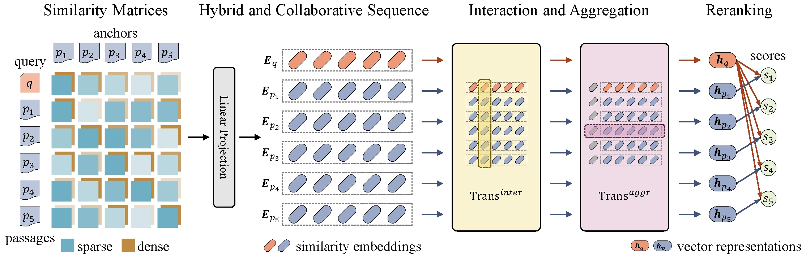

# Hybrid and Collaborative Passage Reranking

Official implementation for [Hybrid and Collaborative Passage Reranking](https://aclanthology.org/2023.findings-acl.880)

## Model Pipeline



## Setup

### Environment Setup

Create conda environment via running:
```shell
conda env create -f environment.yml
conda activate hybrank
```

### Data

Download [preprocessed data for code verification](https://drive.google.com/drive/folders/1qkMkNoN6o5cEq2_2ob5Zpmz6wY7Y5I4e?usp=share_link) including:
* Natural Questions Devset and Testset with DPR-Multi retriever
* Pretrained checkpoint for Natural Questions with DPR-Multi retriever
* MS MARCO Devset and TREC 2019/2020 Testset with ANCE retriever
* Pretrained checkpoint for MS MARCO with ANCE retriever

Preprocessed data for other datasets or retrievers (~800G in total) will not be uploaded due to the space limitation of cloud storage. 

Please contact the authors for these preprocessed data or preprocess by yourself following instructions in `data/README.md`.

## Code Running

### Training

Note that training data should be generated following the instructions in `data/README.md`

Train HybRank on Natural Questions with DPR-Multi retriever:
```shell
python main.py --exp_name NQ_DPR-Multi --data_path data/NQ_DPR-Multi
```

### Evaluation

Evaluate HybRank on Natural Questions with DPR-Multi retriever:
```shell
python main.py --exp_name test_NQ_DPR-Multi --data_path data/NQ_DPR-Multi --resume experiments/NQ_DPR-Multi/best-model.pth --only_eval
```

Evaluate HybRank on MS MARCO with ANCE retriever:
```shell
python main.py --exp_name test_MSMARCO_ANCE --data_path data/MSMARCO_ANCE --resume experiments/MSMARCO_ANCE/best-model.pth --only_eval
```

Evaluate HybRank on TREC 2019 with ANCE retriever:
```shell
python main.py --exp_name test_TRECDL2019_ANCE --data_path data/TRECDL2019_ANCE --resume experiments/MSMARCO_ANCE/best-model.pth --only_eval
```

Evaluate HybRank on TREC 2020 with ANCE retriever:
```shell
python main.py --exp_name test_TRECDL2020_ANCE --data_path data/TRECDL2020_ANCE --resume experiments/MSMARCO_ANCE/best-model.pth --only_eval
```

### Help Information

Display help information by:
```shell
python main.py -h
```

## Reference
Please cite the following paper if HybRank is helpful for your research
```
@inproceedings{zhang-etal-2023-hybrid,
    title = "Hybrid and Collaborative Passage Reranking",
    author = "Zhang, Zongmeng  and
      Zhou, Wengang  and
      Shi, Jiaxin  and
      Li, Houqiang",
    booktitle = "Findings of the Association for Computational Linguistics: ACL 2023",
    month = jul,
    year = "2023",
    address = "Toronto, Canada",
    publisher = "Association for Computational Linguistics",
    url = "https://aclanthology.org/2023.findings-acl.880",
    doi = "10.18653/v1/2023.findings-acl.880",
    pages = "14003--14021",
}
```
